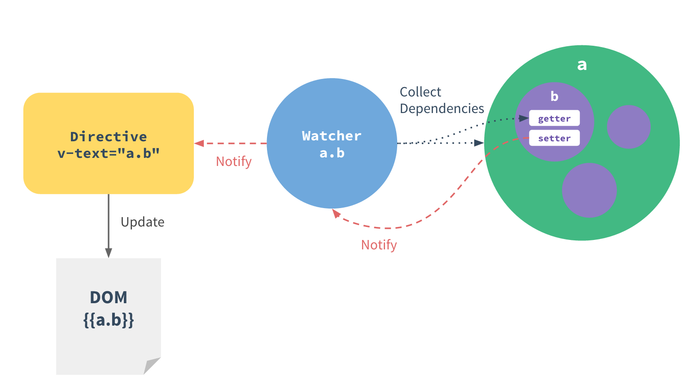

# 概述
大量内容和图片来至[vue.js 官网][1]

## 渐进式框架


核心 = 声明式渲染 + 组件系统

## 声明式渲染


> 在使用 jQuery 手工操作 DOM 时，我们的代码常常是命令式的、重复的与易错的。
> Vue.js 拥抱数据驱动的视图概念。DOM 和数据一旦创建了绑定，DOM 将与数据保持同步。

### 深入响应式原理



`Object.defineProperty`

### 变化检测问题

先定义后使用

> 受 ES5 的限制，Vue.js 不能检测到对象属性的添加或删除

```` javascript
var data = { a: { aa: 1 } }
var vm = new Vue({
  data: data
})
````

可以通过以下方法解决
```` javascript
<del>vm.$set('b', 2); </del> // 实例方法 vue 2.0 已经废弃
Vue.set(data, 'c', 3) // 全局方法
vm.a = Object.assign({}, vm.a, { d: 2 })  // 有时你想向已有对象上添加一些属性
vm.a ={...vm.a, ...{ d: 2 }}  // 上一条的另一种实现
````

因为 JavaScript 的限制，Vue.js 不能检测到下面数组变化：

> 1. 直接用索引设置元素，如 `vm.items[0] = {}`；
> 2. 修改数据的长度，如 `vm.items.length = 0`。

为了解决问题 (1)，Vue.js 扩展了观察数组，为它添加了一个 `$set()` 方法：

```` javascript
// 与 `example1.items[0] = ...` 相同，但是能触发视图更新
example1.items.$set(0, { childMsg: 'Changed!'})
````

至于问题 (2)，只需用一个空数组替换 `items`。
除了 `$set()`， Vue.js 也为观察数组添加了 `$remove()` 方法，用于从目标数组中查找并删除元素，在内部它调用 `splice()` 。

```` javascript
this.items.$remove(item)
````

### 异步更新队列

Vue.js 默认异步更新 DOM。

如果想立即更新，可以通过以下方法实现

```` javascript
Vue.nextTick(callback) // 全局更新
vm.$nextTick() // 局部更新
````

### 计算属性的奥秘

> 你应该注意到 Vue.js 的计算属性不是简单的 getter。
> 
> 只要依赖不发生变化，访问计算属性会直接返回缓存的结果，而不是调用 getter。

[例子](http://cn.vuejs.org/guide/reactivity.html#u8BA1_u7B97_u5C5E_u6027_u7684_u5965_u79D8)

## 组件系统


> 组件系统是用 Vue.js 构建大型应用的基础。

## 参考

* [vuejs 官网][1]
* [前端工程化-基础篇](https://github.com/fouber/blog/issues/10)

[1]:https://vuejs.org
